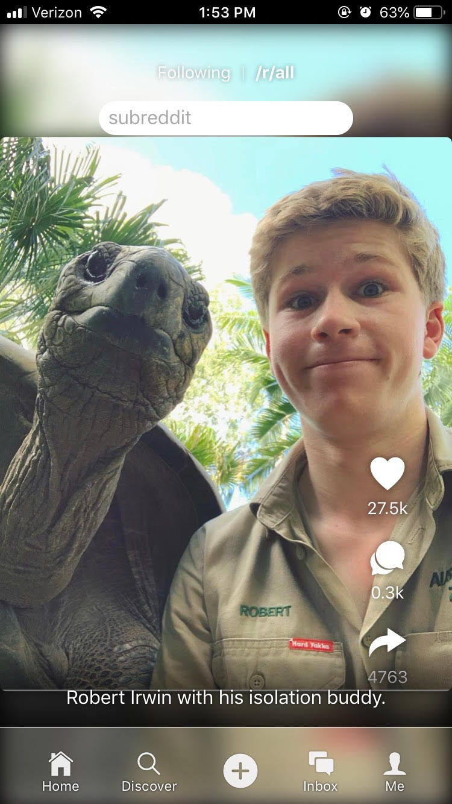
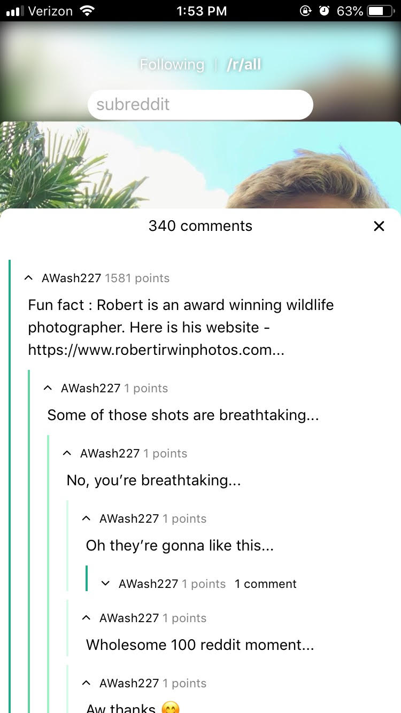
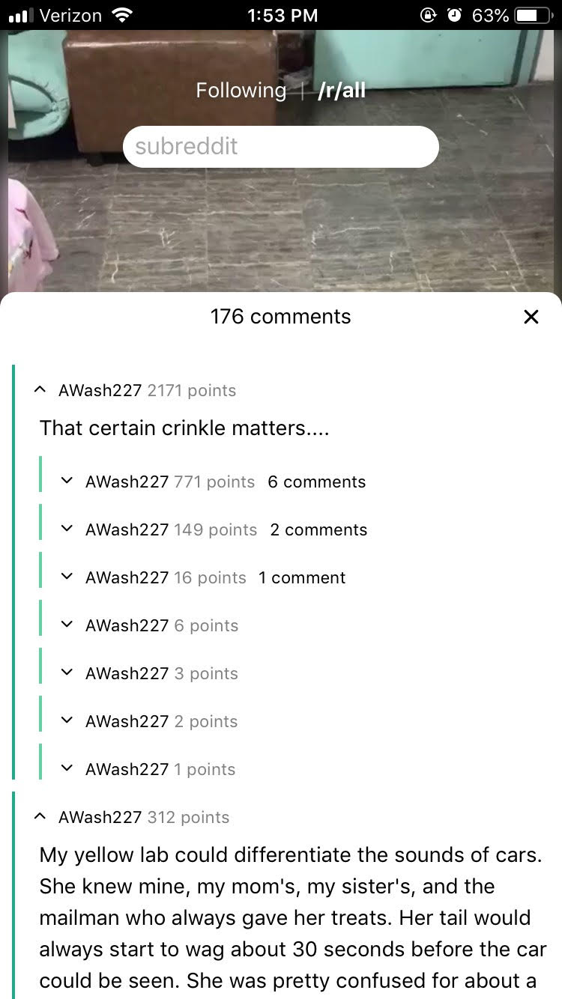

# Reddit (but it's TikTok)

I have long been a viewer of Reddit content. But now there is a new Social Media out there: TikTok. Now, I am not a fan of the content on there, but the app layout is not bad.
So I did what anyone would do and took all of the content on Reddit and put it into Tiktok.

## How it works

Client: React, Redux, Axios
Server: Express

The client side has been custom-made (and programmed) to look as close to TikTok as possible with some features altered to be more user-friendly w/ Reddit content.
Currently, not every feature has been implemented. I'm not sure I intend to continue working on it but on the plus side you have the two most important features working (sorta).

- Viewing Posts!
  - You also have the ability to switch subreddits using the search bar. (You have to click enter twice for some reason though...)
- Comments!

The server side is essentially just a wrapper over the Reddit API w/ two endpoints that enables you to fetch posts and comments. That's all I need right now.
You're probably wondering why we need a wrapper if we're just doing API requests to reddit in the end anyways... Well, it's because of default browser rules on different devices.
They seem to not like it when a website automatically sends requests to another server (it's a CORS error) which is solved by just fetching the data from a server that can disable that rule.
So, the client needs to be bundled with the server to work on any device that is not a development machine.

## Further Improvements

There is a lot more that can be done with this. Right now, the comments system only displays my username right now (this would be the first thing to fix).
Here are some potential further improvements:

- Sign in with your reddit account
  - Like posts
  - Comment on posts
  - Actually post something
- Themes
- Caching and pre-fetching content to make infinite scroll better.
- Fixing the bug where swiping backwards on a post messes up the ordering of posts
- Making the site design desktop friendly (please only use it on mobile right now :) )

## How to run?

1. Clone the repo into a directory
2. Run npm install on both the client and root folders
3. Then execute 'npm start' on both folders (root first, then client)
4. Navigate to appActions.js and postActions.js and change the URL variable in each to DEV_URL
5. Navigate to localhost:300 and it should be working!
